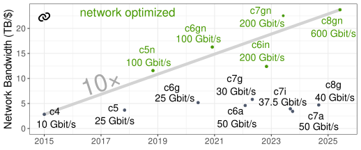

The promise of the cloud is computing as a utility: like electricity from a power socket, the cloud promises computing infrastructure that "just works". The massive scale of the public cloud hyperscalers (AWS, Azure, and Google Cloud) should also yield economies of scale, theoretically translating to lower costs for customers. Cloud adoption has been massive, and even more organizations are moving to the cloud as fast as they can. One consequence of this trend is that public cloud hyperscalers have obtained a large share of the server hardware market.

Over the past decade, AWS transitioned from using commodity hardware (Intel CPUs, Xen virtualization, off-the-shelf NICs and SSDs) to designing custom processors (Graviton)[^1], virtualization technology (Nitro)[^2], networking (ENA NICs and custom network switches)[^3][^4], and flash storage controllers (Nitro SSDs)[^5].
[^1]: <https://aws.amazon.com/ec2/graviton/>
[^2]: <https://aws.amazon.com/ec2/nitro/>
[^3]: <https://aws.amazon.com/blogs/aws/elastic-network-adapter-high-performance-network-interface-for-amazon-ec2/>
[^4]: <https://www.theverge.com/circuitbreaker/2021/3/30/22358633/amazon-reportedly-custom-network-switch-silicon-aws>
[^5]: <https://aws.amazon.com/blogs/aws/aws-nitro-ssd-high-performance-storage-for-your-i-o-intensive-applications/>

AWS's proprietary Graviton instances offer by far the best performance per dollar in AWS, and the gap to Intel/AMD is growing[^6]:
[](https://cloudspecs.fyi/?state=N4IgzgjgNgigrgUwE4E8QC4QGUCiAZHAYQBUACANwEMpFTKxSwAHBAYwEsA7AFwBpSkCKAnoIA+ihFJ+TJO1biAFgHs400gDNKAW3ZQU-LmG6VOC3gB1OpG7dKtRpAO6KE12coVgwypGO3KACZCpFDsANYIpADkAKQAggCyACKx0aTcrtbRScnpLm50SKyKpAC8MZRI2gBsACzpmYXRAOJIlOTs3Mqc6UJgUdEAkjxCfZyBdAwAam6BvjJIngjevv5BQlYAYgBKAPKJdE5gYtRQpABWylykABS7B6QARm4l2lXhpADqABI4Ozhnq9FO8kJ8KtFmGwuNwxBo4FAoGIWJRwtEAJSkOBgLgAczuRhMZgQ6KsvmCSGeKEYLA4PAA9LJ5EpVJTgmBWCBeCAkIQNhgQN0xGByPiADwAWkYouMck4uNuTnYgUy5VIqm4TDg3AAdEqVYodVwSvxXOxcYpuGqNVrdWaLbrjYp+BzqHi1QBGUmcMna22kSWkXG4phQZTcW6BDT8SgrW4ADzVgmEogkUn41IqULp3EZcgUYhUan4rGUYbUatmEwWQaWcCYlbmvnRmIA1FY7K7hGJ42JSzwuHBVGBbmFdNwwGVWLcAEwABg9AGYdQBWXjzmcrlukdvWWy4hDKbRiMKcBC3Nsd-eH49QSgvKC3WMju8PtWE0wKbe7uzB7hdYRbmiQgAAUAFVSBA5ANF8d5iTubQEX-CVMkEShgkmLAQKIGFMRYSkABIMR3K8bAQeMmFMQIT3YccRxQMo50vPcbCabRxCeJwLysKxQ3DW4bW1dEAG5SGCcgdWUDQNAvUShRFBVMQAYnVP1tQyZRSEtbRzkog8uRAO8UA1DBQG4FAWAFZgwm4EAAF87KAA)
[^6]: [Click here to see the plot's source in cloudspecs.fyi](https://cloudspecs.fyi/?state=N4IgzgjgNgigrgUwE4E8QC4QGUCiAZHAYQBUACANwEMpFTKxSwAHBAYwEsA7AFwBpSkCKAnoIA+ihFJ+TJO1biAFgHs400gDNKAW3ZQU-LmG6VOC3gB1OpG7dKtRpAO6KE12coVgwypGO3KACZCpFDsANYIpADkAKQAggCyACKx0aTcrtbRScnpLm50SKyKpAC8MZRI2gBsACzpmYXRAOJIlOTs3Mqc6UJgUdEAkjxCfZyBdAwAam6BvjJIngjevv5BQlYAYgBKAPKJdE5gYtRQpABWylykABS7B6QARm4l2lXhpADqABI4Ozhnq9FO8kJ8KtFmGwuNwxBo4FAoGIWJRwtEAJSkOBgLgAczuRhMZgQ6KsvmCSGeKEYLA4PAA9LJ5EpVJTgmBWCBeCAkIQNhgQN0xGByPiADwAWkYouMck4uNuTnYgUy5VIqm4TDg3AAdEqVYodVwSvxXOxcYpuGqNVrdWaLbrjYp+BzqHi1QBGUmcMna22kSWkXG4phQZTcW6BDT8SgrW4ADzVgmEogkUn41IqULp3EZcgUYhUan4rGUYbUatmEwWQaWcCYlbmvnRmIA1FY7K7hGJ42JSzwuHBVGBbmFdNwwGVWLcAEwABg9AGYdQBWXjzmcrlukdvWWy4hDKbRiMKcBC3Nsd-eH49QSgvKC3WMju8PtWE0wKbe7uzB7hdYRbmiQgAAUAFVSBA5ANF8d5iTubQEX-CVMkEShgkmLAQKIGFMRYSkABIMR3K8bAQeMmFMQIT3YccRxQMo50vPcbCabRxCeJwLysKxQ3DW4bW1dEAG5SGCcgdWUDQNAvUShRFBVMQAYnVP1tQyZRSEtbRzkog8uRAO8UA1DBQG4FAWAFZgwm4EAAF87KAA)

Using custom network hardware, AWS also offers fast and cheap networking[^7]:
[](https://cloudspecs.fyi/?state=N4IgzgjgNgigrgUwE4E8QC4QGUCiAZHAYQBUACAKgBpSAKAYwEMwFSB3ACwQDtSAzBgLYBLKClJQhAaxYByAKRcZpYgAkcAOWUAlAKo5S+XKQBiAQTxGNAEQCUpIWAD6XBABdWAeySTHHgA6uQsIAXggAJgA6XMZaAPIAsqQMrE78wqJRAOpqWvppImIAkpo0MnQALDLUZQCsVaRlAGwA5vVNDG10AOyt1d1CnQAcrXaxWnyCBaR4hQDS+mUKMiCUIEiEHmEIGCCuHo5gAG7NpAA8ALSkR81grkhCXM00rEJhruykALykHnCufn8AHQvN7sQEPOjsaicITNdiuL4-P4A1yAmFw1EQqFXRgSR6IgCMNiiUV+-z+Z0uzWafigHlcNDCvGoDAQYBoAA9PkgEFAEEwEI4UPykNQUJ8aABmRoABhlFFILlcjmaACMhP8wAB6Aly+Va0iDGxavz3OiC9i-UVRUi2u32h2kOgeOlIT4OZxuTzeXwBIJCUJhSg2x2h21QBiq3mfPxMVwIGj5UTVCJRepKlXqzXVADiWa1YBkNmLpAA1CHw5H2RzETI8Aw4FxIaQAJoi+pib4ydRerySUgAIQYXDCIPetGIA61ABIbEWyxXSM0EB4BI54xyGXZyzw7WBcYLna7HAJh3AGFAaIcL4gwIjT9JAbG+a54-RSsRdDglF2wgxvOczQ8twbRmBY361qqEZ0JIRYlju9rLqujh+B4DwMkeXifDIQEICg84IXa1KBK4fKlD27h9qQqrDqOrzjnc3BhARi4IBysYjo4EjCK47LijK26Lu8CACIKqqsDQxJcFEtL0jQZIojYADcpBbIcgIeLwvCSSpewHMckmkAAxEi5IInspDwgIUCkLGy4rCAEYoGSGCgK4KB+NsmBgLSGogAAvv5QA)
[^7]: [Click here to see the plot's source in cloudspecs.fyi](https://cloudspecs.fyi/?state=N4IgzgjgNgigrgUwE4E8QC4QGUCiAZHAYQBUACAKgBpSAKAYwEMwFSB3ACwQDtSAzBgLYBLKClJQhAaxYByAKRcZpYgAkcAOWUAlAKo5S+XKQBiAQTxGNAEQCUpIWAD6XBABdWAeySTHHgA6uQsIAXggAJgA6XMZaAPIAsqQMrE78wqJRAOpqWvppImIAkpo0MnQALDLUZQCsVaRlAGwA5vVNDG10AOyt1d1CnQAcrXaxWnyCBaR4hQDS+mUKMiCUIEiEHmEIGCCuHo5gAG7NpAA8ALSkR81grkhCXM00rEJhruykALykHnCufn8AHQvN7sQEPOjsaicITNdiuL4-P4A1yAmFw1EQqFXRgSR6IgCMNiiUV+-z+Z0uzWafigHlcNDCvGoDAQYBoAA9PkgEFAEEwEI4UPykNQUJ8aABmRoABhlFFILlcjmaACMhP8wAB6Aly+Va0iDGxavz3OiC9i-UVRUi2u32h2kOgeOlIT4OZxuTzeXwBIJCUJhSg2x2h21QBiq3mfPxMVwIGj5UTVCJRepKlXqzXVADiWa1YBkNmLpAA1CHw5H2RzETI8Aw4FxIaQAJoi+pib4ydRerySUgAIQYXDCIPetGIA61ABIbEWyxXSM0EB4BI54xyGXZyzw7WBcYLna7HAJh3AGFAaIcL4gwIjT9JAbG+a54-RSsRdDglF2wgxvOczQ8twbRmBY361qqEZ0JIRYlju9rLqujh+B4DwMkeXifDIQEICg84IXa1KBK4fKlD27h9qQqrDqOrzjnc3BhARi4IBysYjo4EjCK47LijK26Lu8CACIKqqsDQxJcFEtL0jQZIojYADcpBbIcgIeLwvCSSpewHMckmkAAxEi5IInspDwgIUCkLGy4rCAEYoGSGCgK4KB+NsmBgLSGogAAvv5QA)

The dominance of the hyperscalers is even more pronounced at the infrastructure service level (storage, databases). Foundational services, such as object storage (S3) and virtualized block storage (EBS), are primarily dominated by hyperscalers. For the database market, Gartner estimated that by 2021, AWS already owned a quarter of the $80B/year database market revenue[^8] --- not too shabby for a company that started as a bookstore.
[^8]: <https://web.archive.org/web/20230202181343/https://blogs.gartner.com/merv-adrian/2022/04/16/dbms-market-transformation-2021-the-big-picture>

The big market share in server hardware and infrastructure services, combined with a high-level service ecosystem, positively reinforce each other. Thus, we appear to be on the path to a vertically integrated monopoly similar to the IBM of the 1960s-1980s ("Big Blue") or the Microsoft/Intel ("Wintel") duopoly of the 1990s and 2000s. In their respective eras, IBM and Microsoft/Intel ruled the computing world, setting most relevant standards and forcing everyone to be part of the ecosystem or risk becoming irrelevant.

If we extrapolate current cloud trends, it appears that AWS may soon be in a similar position. AWS invented the modern incarnation of the cloud and is still the technology and market leader. The other hyperscalers usually follow with very similar offerings and prices. So, should we simply accept the fact that resistance to "Big Orange" is futile? Should we all just assimilate into the Borg collective?

The cloud is becoming a foundational technology of our society, and allowing one company to control it may not be the best idea: too much market power leads to very high prices and limits innovation. It is sometimes claimed that the sheer scale and custom hardware make it impossible to offer prices competitive with those of the hyperscalers. Luckily, that is not the case yet, as the following table comparing prices of AMD virtual machines with identical specs (32 vCPUs, 128 GB of RAM) illustrates [^9]:
[^9]: <https://www.cs.cit.tum.de/fileadmin/w00cfj/dis/papers/cloudspecs-final.pdf>

<!-- M-x markdown-table-align -->
|    Cloud |                     Instance | vCPUs | RAM | $/month |
|---------:|-----------------------------:|------:|----:|--------:|
|  AWS EC2 |        m6a.8xlarge  (Epyc 3) |    32 | 128 |     995 |
| MS Azure |            D32as v5 (Epyc 3) |    32 | 128 |     991 |
|   Google |     t2d-standard-32 (Epyc 3) |    32 | 128 |     973 |
|   Oracle | VM.Standard.E4.Flex (Epyc 3) |    32 | 128 |     426 |
| OVHCloud |              B3-128 (Epyc 3) |    32 | 128 |     616 |
|  Hetzner |             CCX53 (Epyc 3/4) |    32 | 128 |     255 |

AWS, Microsoft, and Google have suspiciously similar prices. Hetzner, a relatively small, independent (and profitable) cloud provider from Germany, offers similar hardware for a quarter of the cost. This pricing gap is possible because server hardware is still a highly competitive commodity market. For example, the list price for a Dell PowerEdge server with similar specs is around $5,000, which means hyperscalers recoup their server costs in about 5 months. Note that these are on-demand prices, so in practice most customers will pay a fraction of these prices --- but this is the case for all vendors (including Hetzner and Dell).

Another infamous example of very high cost is egress fees, i.e., the cost of moving data out of the cloud. Again, AWS, Google, and Azure have suspiciously similar prices at $0.05 or $0.04 per GB --- while Hetzner charges only $0.0012 (40x less). The magnitude of this shows that egress prices are not tied to real costs --- they're about avoiding competition and locking customers in.

The existence of low-cost cloud vendors shows that it is still possible to out-compete the hyperscalers at the lowest level of virtual machines. The Big Orange dystopia is not yet inevitable\! However, smaller cloud vendors can only offer a subset of the services on top, making them niche players. Thus, the crucial step towards true competition and innovation in the cloud is to provide new infrastructure services that work in all clouds. Just as Linux, the Internet, and open source helped unbundle the Microsoft monopoly, we need to rethink cloud foundations to restore competition and innovation.
