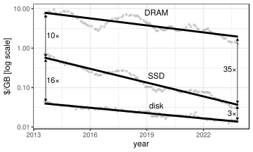

Amazon S3, and its analogues in other clouds, have become the foundation of the modern cloud software architecture. Today, nearly every data-intensive system is being built around S3. However, the hardware assumptions baked into S3's design -- and into all the software architectures that have emerged around it -- are rapidly becoming obsolete.

S3's dominance is due to its many advantages: effectively infinite capacity, high durability, and low per-gigabyte capacity cost. For large objects and parallel accesses, it delivers high aggregate bandwidth. S3 provides a shared, durable namespace that allows compute to remain mostly stateless. For example, the open data lake stack (Iceberg + Parquet + S3) has become the foundation of analytics in the cloud. [Warpstream](https://www.warpstream.com/) is Kafka on top of S3. [Turbopuffer](https://turbopuffer.com/) builds vector storage on it. S3 has become the system of record, the long-term store, the backup target, and generally the source of truth. The default architecture for a new data system is: put the data in S3, run stateless compute over it.

S3 is, in a meaningful sense, a million hard disks behind an HTTP API. Each individual request yields less than 100 MB/s and latency is measured in tens of milliseconds[^1]. These properties are not incidental; they are caused by the physical characteristics of disks, and they impose an architectural tax on every system built on top of S3. You need caching layers to hide the latency. You need to batch small writes into large objects to amortize the per-request overhead. You need a separate metadata store (e.g., DynamoDB, FoundationDB) because S3 itself cannot efficiently serve small, random lookups. You cannot update a record in-place but must rewrite the entire object. Consequently, every serious S3-based software design is, in part, a system for working around S3's limitations.

S3 was released 20 years ago. Since then SSD prices have been dropping steadily[^2], and the gap between SSD and disk has narrowed to roughly 3×[^3]:

This is important because SSDs have fundamentally different performance: access latency around 100 microseconds (two orders of magnitude faster than S3), millions of I/O operations per second per device, and small random read/write granularity down to 4 KB. Modern datacenter networks have kept pace: 100+ Gbit links deliver sub-100-microsecond latency within a datacenter and under a millisecond across different datacenters in the same region.

SSD-based, disaggregated storage coupled with datacenter-class networking could remove many of the constraints and workarounds that define today's S3-centric designs. When storage responds in microseconds, caching becomes optional. When small random accesses are cheap, batching is no longer mandatory. When updates can be performed in place, compaction and reorganization become unnecessary. Metadata and data storage can be unified in a single system because the storage can serve both access patterns efficiently.

Amazon's SSD-based offering, S3 Express One Zone, launched in 2023. It is restricted to a single availability zone, sacrificing the durability and availability guarantees that make S3 the default choice for production data. Despite this significant concession, it still has multi-millisecond latency: far from what modern SSDs and networks are capable of. Its per-gigabyte capacity cost is substantially higher than standard S3, and its bandwidth pricing is steep enough to discourage the high-throughput access patterns that would make low-latency storage most valuable. The result is a niche product with a narrow set of use cases, not a foundation for the next generation of data systems.

Yet there is no fundamental technological barrier to building a true SSD-based, disaggregated storage service with the durability, capacity, and pricing profile needed to serve as a general-purpose replacement for S3. Fast SSDs exist. Fast networks exist. What is missing is initiative. The cloud providers have enormous numbers of hard disks, enormous revenue streams built on the current pricing model, and little incentive to cannibalize either. The obstacle is inertia, not technology.

The irony is that S3-based architecture is becoming the industry standard at precisely the time when the hardware constraints that motivated it are fading. We are codifying architectural patterns that exist to work around limitations that SSD-based storage simply does not have. The cloud providers have no incentive to disrupt a model that serves them well, so we shouldn’t wait for them to lead this transition, we should build the infrastructure primitives ourselves.

[^1]: <https://www.vldb.org/pvldb/vol16/p2769-durner.pdf>
[^2]: Due to the AI-craze SSD, DRAM, and disk prices quadrupled early 2026 -- but this happened more or less in unisono.
[^3]: <https://www.vldb.org/pvldb/vol17/p4536-leis.pdf>
